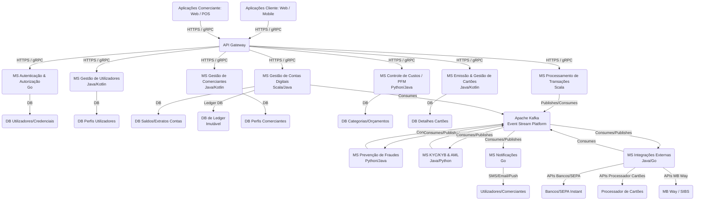

# Proposta de Arquitetura e Implementação para uma Plataforma de Pagamentos Digitais

## 1. Introdução

Este documento detalha a arquitetura e as diretrizes de implementação para uma plataforma de pagamentos digitais multifuncional, abrangendo microtransações P2P (pessoa a pessoa), pagamentos P2B (pessoa a negócio) via QR Code/ID, controle de custos, e futura expansão para cartões físicos/digitais e NFC. O objetivo é construir um sistema robusto, seguro, escalável e compatível com as regulamentações financeiras, como a PSD2 (Payment Services Directive 2) e os requisitos do Banco de Portugal.

### 1.1. Contexto Regulatório (Ponto CRÍTICO)

Antes de qualquer desenvolvimento técnico, é fundamental compreender que operar um sistema de pagamentos em Portugal exige **licenciamento do Banco de Portugal**. As licenças relevantes são:

- **Instituição de Pagamento (IP):** Para serviços como execução de operações de pagamento, emissão de instrumentos de pagamento, e serviços de iniciação/informação sobre contas (PIS/AIS).
- **Instituição de Moeda Eletrónica (IME):** Permite a emissão de moeda eletrónica (carteiras digitais) e todos os serviços de uma IP.

O processo de licenciamento é complexo e exige um plano de negócios detalhado, capital social mínimo, estruturas de governança e compliance robustas (especialmente para AML/CFT - Anti-Money Laundering / Combating the Financing of Terrorism), e auditorias de segurança. **Recomenda-se vivamente o contacto com o Banco de Portugal (via Portugal FinLab) e a consulta de advogados especializados em Direito Financeiro/Fintech.**

---

## 2. Visão Geral do Sistema e Funcionalidades

A plataforma será composta por vários módulos que interagem para oferecer os seguintes serviços:

- **Gestão de Contas Digitais/Carteiras:** Criação, gestão de saldos, histórico de transações para utilizadores individuais e negócios.
- **Transferências P2P:** Pagamentos instantâneos entre utilizadores da plataforma (via ID, número de telefone, email).
- **Pagamentos P2B:** Geração e leitura de QR Code (estático e dinâmico), pagamento por ID/Referência, notificações de pagamento em tempo real para comerciantes.
- **Controle de Custos (PFM):** Categorização de transações, orçamentos, relatórios de gastos.
- **Gestão de Comerciantes:** Onboarding (KYB - Know Your Business), gestão de perfis, ferramentas de recebimento e liquidação.
- **Integrações Externas:**
  - Com sistemas bancários (SEPA Instant para liquidação e PIS/AIS).
  - Com redes de cartões (Visa/Mastercard) e processadores (para emissão e transações de cartões).
  - Possível integração com sistemas locais (ex: MB Way, via parcerias específicas).
- **Segurança e Conformidade:** Autenticação Forte do Cliente (SCA), KYC/KYB, AML/CFT, Prevenção de Fraudes, Auditoria e PCI DSS (futuramente).
- **APIs:** Para integração com sistemas de terceiros (comerciantes, agregadores, etc.).
- **Interfaces de Utilizador:** Aplicações móveis (iOS/Android) e Portal Web (para utilizadores e comerciantes).

---

## 3. Requisitos Não Funcionais Críticos

- **Disponibilidade:** 24/7, com tempo de inatividade mínimo (objetivo de 99.99%).
- **Escalabilidade:** Capacidade de lidar com milhões de utilizadores e um volume elevado de transações por segundo.
- **Performance:** Baixa latência para transações críticas (pagamentos instantâneos).
- **Segurança:** Proteção de dados sensíveis, prevenção robusta de fraudes, conformidade com PCI DSS (se lidar com dados de cartão).
- **Confiabilidade e Resiliência:** Tolerância a falhas, recuperação de desastres e consistência de dados.
- **Auditabilidade:** Todas as ações e transações devem ser imutavelmente registadas e rastreáveis para fins de conformidade e investigação.
- **Manutenibilidade:** Código modular, fácil de entender, testar e atualizar.
- **Conformidade Regulatória:** Estrita aderência às regulamentações financeiras nacionais e da UE (PSD2, GDPR, AML/CFT).

---

## 4. Arquitetura de Microsserviços

A arquitetura será baseada em microsserviços para garantir modularidade, escalabilidade, resiliência e a capacidade de usar as melhores ferramentas para cada tarefa.

**Princípios Chave:**

- **Desacoplamento:** Cada serviço é independente e se comunica via APIs bem definidas ou mensagens assíncronas.
- **Responsabilidade Única:** Cada serviço foca numa funcionalidade específica.
- **Persistência Poliglota:** Cada serviço pode escolher a base de dados mais adequada para as suas necessidades.
- **Comunicação Assíncrona:** Uso intensivo de filas de mensagens e _event streaming_ para transações e eventos críticos.
- **API Gateway:** Ponto de entrada único e seguro para todas as requisições externas.
- **Service Discovery:** Para que os serviços se encontrem e se comuniquem dinamicamente.

### 4.1. Diagrama de Arquitetura (Conceitual)

### 4.2. Detalhes dos Microsserviços e Escolha de Linguagens

A escolha da linguagem para cada microsserviço baseia-se nas suas características intrínsecas e nos requisitos específicos do domínio:

- **Go:** Excelente para serviços de baixa latência, alta concorrência, e com uso intensivo de I/O. Ideal para componentes de infraestrutura.
- **Java (com Spring Boot/Quarkus):** Linguagem robusta, madura, com ecossistema vastíssimo e comprovada para sistemas enterprise. Ideal para lógica de negócio complexa e que requer forte tipagem e estabilidade. Kotlin é uma alternativa moderna e interoperável na JVM.
- **Scala (com Akka/Play):** Combina programação orientada a objetos e funcional. Excelente para concorrência, sistemas distribuídos e processamento de dados de alto volume. Perfeita para sistemas transacionais complexos e resilientes.

---

#### 4.2.1. Microsserviços de Infraestrutura e Performance Crítica

- **API Gateway**

  - **Função:** Ponto de entrada unificado, autenticação inicial, autorização, _rate limiting_, roteamento.
  - **Linguagem Recomendada:** **Go**
    - **Justificativa:** Concorrência eficiente (goroutines), baixa latência, pequeno _footprint_ de memória, rápido _startup_. Ideal para um _proxy_ de alta performance.
  - **Tecnologias:** Nginx (com OpenResty), Kong, Apache APISIX, ou implementação customizada em Go.

- **Serviço de Autenticação e Autorização (IAM - Identity & Access Management)**

  - **Função:** Gestão de utilizadores (registos, logins), autenticação (username/password, MFA - Multi-Factor Authentication), emissão e validação de tokens JWT, autorização (controlo de acessos). Implementação de SCA (Strong Customer Authentication) conforme PSD2.
  - **Linguagem Recomendada:** **Go**
    - **Justificativa:** Para gerir um grande volume de requisições de autenticação com baixa latência. Alternativamente, **Java com Spring Security/OAuth2** para um ecossistema mais rico em segurança.
  - **BD:** PostgreSQL (para dados de utilizadores e credenciais criptografadas), Redis (para cache de tokens, sessões e _rate limiting_).
  - **Padrões:** OAuth 2.0, OpenID Connect.

- **Serviço de Notificações**
  - **Função:** Envio de notificações transacionais (SMS, e-mail, push notifications) e alertas (ex: pagamento recebido pelo comerciante).
  - **Linguagem Recomendada:** **Go**
    - **Justificativa:** Eficiência em I/O para lidar com grande volume de notificações, concorrência para envio paralelo.
  - **Tecnologias:** Integração com serviços de SMS/Email (ex: Twilio, SendGrid), Firebase Cloud Messaging (FCM) para push.

---

#### 4.2.2. Microsserviços Core de Negócio (Transacionais)

- **Serviço de Gestão de Contas Digitais**

  - **Função:** Criação, gestão e encerramento de contas digitais/carteiras para utilizadores e negócios. Gestão de saldos e extratos (visualização).
  - **Linguagem Recomendada:** **Scala** ou **Java (com Spring Boot)**
    - **Justificativa:** Scala, devido à sua capacidade de lidar com concorrência e o foco em imutabilidade e programação funcional (Akka), é excelente para garantir a consistência e integridade dos saldos. Java oferece robustez comprovada.
  - **BD:** PostgreSQL (para detalhes das contas e saldos atuais), e um **Banco de Dados de Ledger (ex: Amazon QLDB ou customizado)** para o registo imutável de todas as alterações de saldo (débitos e créditos), crucial para auditoria e resiliência.

- **Serviço de Processamento de Transações**
  - **Função:** O coração do sistema. Orquestração e execução de todas as microtransações (P2P, P2B, QR Code, ID), validação de saldos, aplicação de taxas, registo de movimentos. Comunica-se intensivamente via _event stream_.
  - **Linguagem Recomendada:** **Scala** (com Akka e/ou Cats/ZIO)
    - **Justificativa:** A programação funcional e o modelo de ator (Akka) em Scala são ideais para construir sistemas transacionais distribuídos, resilientes e tolerantes a falhas. Garante a integridade dos dados e a ordem das operações em cenários de alta concorrência.
  - **BD:** Não possui BD próprio primário, mas interage com o Serviço de Contas (para atualização de saldos) e com o Kafka (para registo de eventos transacionais).

---

#### 4.2.3. Microsserviços de Suporte e Extensão

- **Serviço de Gestão de Utilizadores**

  - **Função:** Gestão do perfil do utilizador (dados pessoais, contactos), KYC (Know Your Customer) - validação de identidade, documentos.
  - **Linguagem Recomendada:** **Java/Kotlin (com Spring Boot)**
    - **Justificativa:** Para lógica de negócio complexa de onboarding, integração com APIs de verificação de identidade e gestão de documentos.
  - **BD:** PostgreSQL.

- **Serviço de Gestão de Comerciantes**

  - **Função:** Onboarding de comerciantes (KYB - Know Your Business), gestão de perfis de negócio, geração de QR Codes (estático/dinâmico), gestão de terminais/integradores (se aplicável), gestão de taxas e liquidações.
  - **Linguagem Recomendada:** **Java/Kotlin (com Spring Boot)**
    - **Justificativa:** Requisitos de negócio complexos, integração com APIs de contabilidade/ERP para _reporting_ e liquidação.
  - **BD:** PostgreSQL.

- **Serviço de Prevenção de Fraudes**

  - **Função:** Análise de transações em tempo real e em lote para identificar padrões suspeitos, pontuação de risco, bloqueio de transações, alertas.
  - **Linguagem Recomendada:** **Python** ou **Java**
    - **Justificativa:** **Python** para integração com bibliotecas de Machine Learning (TensorFlow, PyTorch) para modelos de deteção de fraude. **Java** para regras de negócio complexas e sistemas de _rule engine_ de alta performance.
  - **Tecnologias:** Apache Flink (para processamento de _stream_ em tempo real), bases de dados NoSQL (ex: Cassandra, Redis) para dados de _feature store_.
  - **Comunicação:** Consome eventos de transação do Kafka.

- **Serviço de KYC/KYB & AML (Anti-Money Laundering)**

  - **Função:** Processamento e armazenamento de dados de KYC/KYB, monitorização transacional para AML, geração de relatórios de atividades suspeitas (SARs) para as autoridades.
  - **Linguagem Recomendada:** **Java/Kotlin (com Spring Boot)**
    - **Justificativa:** Regras de negócio complexas, requisitos regulatórios rigorosos, necessidade de auditoria e logs detalhados.
  - **BD:** PostgreSQL.

- **Serviço de Controle de Custos (PFM - Personal Financial Management)**

  - **Função:** Categorização automática/manual de transações, definição de orçamentos, relatórios visuais de gastos e receitas.
  - **Linguagem Recomendada:** **Python** ou **Java/Kotlin**
    - **Justificativa:** **Python** é rápido para prototipar e pode usar bibliotecas de ML para categorização. **Java/Kotlin** se a lógica for mais integrada com outros serviços _core_.
  - **BD:** PostgreSQL ou MongoDB (para flexibilidade de dados).

- **Serviço de Emissão e Gestão de Cartões (Futuro)**

  - **Função:** Gestão do ciclo de vida do cartão (emissão, ativação, bloqueio, cancelamento), gestão de limites, PIN, integração com _card processors_ (Visa, Mastercard).
  - **Linguagem Recomendada:** **Java/Kotlin (com Spring Boot)**
    - **Justificativa:** Requisitos de segurança e conformidade muito altos (PCI DSS), lógica complexa de integração com redes de cartões.
  - **BD:** PostgreSQL.

- **Serviço de Integrações Externas**
  - **Função:** Gerir a comunicação com APIs externas de bancos (PIS/AIS, SEPA Instant), processadores de cartões, sistemas MB Way, etc.
  - **Linguagem Recomendada:** **Java/Kotlin (com Spring Boot)** ou **Go**
    - **Justificativa:** Java é excelente para integrações complexas e robustas, enquanto Go pode ser usado para _adapters_ de alta performance a APIs específicas.
  - **Tecnologias:** Implementação de conectores PSD2 (Berlin Group, etc.), SDKs de processadores de cartões.

---

### 4.3. Componentes de Infraestrutura e Plataforma

- **Plataforma de Event Stream:** **Apache Kafka**
  - **Função:** O _backbone_ da comunicação assíncrona entre microsserviços. Garante durabilidade, ordem de eventos e escalabilidade para o processamento de transações. Crucial para Event Sourcing e auditoria.
- **Bases de Dados:**
  - **PostgreSQL:** Banco de dados relacional primário para a maioria dos microsserviços (dados de utilizador, comerciante, perfis, etc.). Oferece robustez, ACID, e flexibilidade.
  - **Redis:** Para cache, _rate limiting_, sessões, e filas de mensagens de curta duração.
  - **Banco de Dados de Ledger (ex: Amazon QLDB ou implementação customizada):** Crucial para o registro **imutável** e **auditável** de todas as transações financeiras. Cada transação é um novo registo que não pode ser alterado.
- **Orquestração de Contêineres:** **Kubernetes (K8s)**
  - **Função:** Deploy, escalabilidade e gestão de microsserviços em produção.
  - **Tecnologias:** Docker (para conteinerização).
- **Provedor de Cloud:** **AWS, Azure ou Google Cloud Platform (GCP)**
  - **Função:** Fornece a infraestrutura necessária (servidores, bases de dados gerenciadas, redes, ferramentas de segurança, etc.). Essencial para escalabilidade, alta disponibilidade e agilidade no _deploy_.
- **Monitorização e Logging:** Prometheus, Grafana, ELK Stack (Elasticsearch, Logstash, Kibana), ou ferramentas da Cloud (CloudWatch, Azure Monitor, Google Cloud Logging/Monitoring).
- **Integração Contínua/Entrega Contínua (CI/CD):** Jenkins, GitLab CI/CD, GitHub Actions.

---

## 5. Fluxos de Exemplo (Simplificados)

### 5.1. Transferência P2P (Utilizador A para Utilizador B)

1.  **Utilizador A** inicia transferência na App.
2.  **App** envia requisição para **API Gateway**.
3.  **API Gateway** autentica/autoriza e roteia para **MS Processamento de Transações**.
4.  **MS Processamento de Transações** valida:
    - Saldo do Utilizador A (via **MS Contas Digitais**).
    - Existência do Utilizador B (via **MS Gestão de Utilizadores**).
    - Verifica regras de fraude (via **MS Prevenção de Fraudes**).
5.  Se validado, **MS Processamento de Transações** publica um evento `TransactionInitiated` no **Kafka**.
6.  **MS Contas Digitais** (consumindo do Kafka) processa o débito na conta de A e o crédito na conta de B. Registra a transação no **DB Ledger** e atualiza saldos no PostgreSQL. Publica eventos `DebitPosted` e `CreditPosted`.
7.  **MS Notificações** (consumindo do Kafka) envia notificações para Utilizador A (confirmação) e Utilizador B (recebimento).
8.  **MS KYC/AML** (consumindo do Kafka) monitoriza a transação para conformidade.

### 5.2. Pagamento QR Code (Cliente para Comerciante)

1.  **Comerciante** gera QR Code (estático/dinâmico) via **MS Gestão de Comerciantes** e exibe.
2.  **Cliente** lê QR Code na App.
3.  **App** envia requisição de pagamento (com valor, se QR estático) para **API Gateway**.
4.  **API Gateway** autentica/autoriza e roteia para **MS Processamento de Transações**.
5.  **MS Processamento de Transações** valida e publica `PaymentInitiated` no **Kafka**.
6.  **MS Contas Digitais** debita o cliente e credita a conta digital do comerciante. Registra no **DB Ledger**.
7.  **MS Notificações** envia confirmação para o cliente e notifica o comerciante instantaneamente.
8.  **MS Prevenção de Fraudes** e **MS KYC/AML** atuam sobre o evento.
9.  **MS Gestão de Comerciantes** inicia o processo de liquidação para transferir fundos para a conta bancária tradicional do comerciante (pode ser um evento diário/semanal).

---

## 6. Considerações Adicionais para Implementação

- **Segurança:**
  - **Criptografia:** TLS/SSL para comunicação, criptografia em repouso para dados sensíveis em DBs.
  - **Gestão de Chaves:** Uso de serviços de gestão de chaves (ex: AWS KMS, Azure Key Vault) ou HSMs (Hardware Security Modules) para chaves criptográficas.
  - **Pentesting e Auditorias:** Realização regular de testes de penetração e auditorias de segurança por terceiros.
  - **Controle de Acesso:** Princípio do menor privilégio para todos os sistemas e utilizadores.
- **DevOps e CI/CD:** Automação completa do pipeline de desenvolvimento, testes, _deploy_ e monitorização para garantir entregas rápidas e fiáveis.
- **Testes:** Estratégia de testes abrangente: unitários, de integração, de sistema, de carga, de segurança e de regressão.
- **Monitorização e Alertas:** Implementação de monitorização em tempo real de performance, erros, segurança e uso de recursos, com alertas proativos para a equipa de operações.
- **Documentação:** Manter a arquitetura, APIs, e processos bem documentados.
- **Reconciliação:** Mecanismos robustos para reconciliar todas as transações financeiras, interna e externamente.

---

## 7. Próximos Passos Sugeridos

1.  **Confirmação Regulatória:** Iniciar conversações com o Banco de Portugal e consultores jurídicos especializados para validar a viabilidade e os requisitos de licenciamento.
2.  **Equipa:** Montar uma equipa multidisciplinar com expertise em desenvolvimento de software (Java, Go, Scala), arquitetura de sistemas distribuídos, segurança cibernética, engenharia de dados e compliance financeiro.
3.  **Design Detalhado:** Aprofundar o design de cada microsserviço, definindo interfaces de API, modelos de dados e fluxos de trabalho específicos.
4.  **Prova de Conceito (PoC):** Construir uma PoC dos módulos mais críticos (ex: Gestão de Contas e Processamento de Transações) para validar a arquitetura e as escolhas tecnológicas.
5.  **Definição de Parcerias:** Iniciar contactos com bancos (para liquidação/SEPA), processadores de cartões e outros parceiros tecnológicos necessários.

# Links Úteis

1. https://apisandbox.openbankproject.com/
